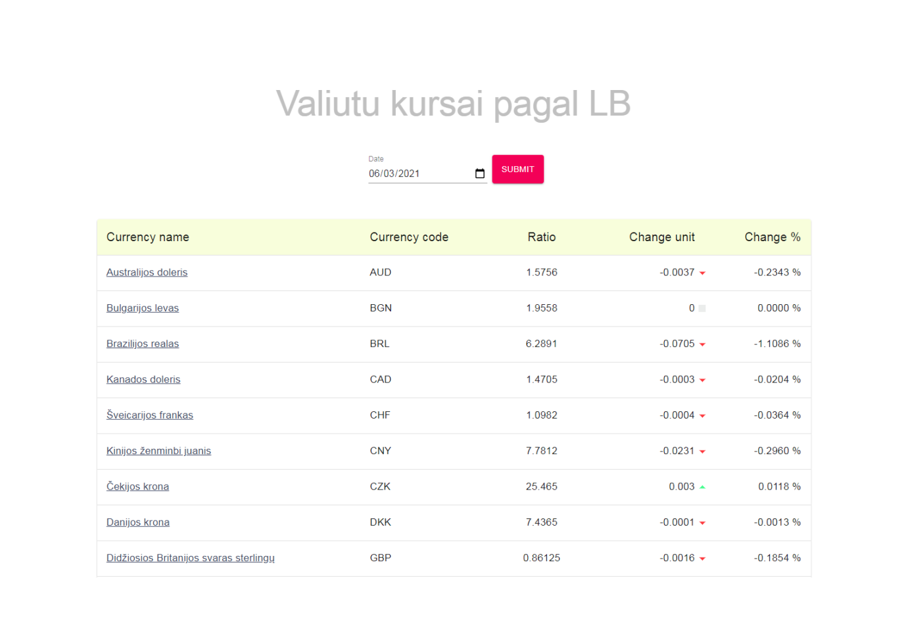
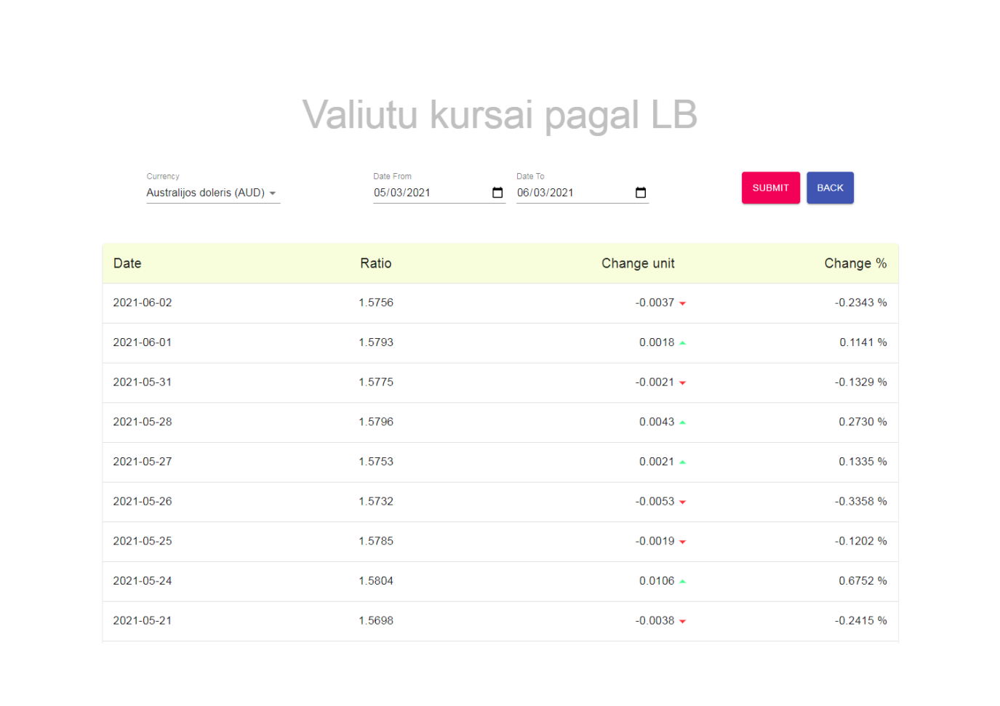

# Exchange-Rates System
The system is designed to monitor currency exchange rates based on [lb.lt](https://www.lb.lt/lt/kasdien-skelbiami-euro-ir-uzsienio-valiutu-santykiai-skelbia-europos-centrinis-bankas).

___

## Getting started
1. Clone the [repository](https://github.com/Lukasevic-Robert/Exchange-Rates-Full-Stack)
2. Open _Spring Tools Suite_ 
3. Import project: File -> Import... -> Maven -> Existing Maven Projects -> Next -> Browse... ->
_select folder the project was saved in f. ex.:_ G:\Programs\Exchange_Rates_System\ **back** -> Finish
3. Right Mouse Click on the project -> Run As -> Spring Boot App
4. Open _Visual Studio Code_
5. Open project File -> Open Folder... -> _select folder the project was saved in f.ex.:_ G:\Programs\Exchange_Rates_System\ **front** -> Select Folder
3. Open terminal: Terminal -> New Terminal
4. Command in the opened terminal to install required packages:  **npm i**  
5. Command in the opened terminal to start the project: **npm start**
6. System will open on port [3000](http://localhost:3000/)

___

## root page http://localhost:3000/
Index page is "**/**" or "**/all-in-one**". Here you can see all provided currency exchange rates for specific date. By pressing on **Currency Name** redirect is activated to "**/specific**" page.

___

## child page http://localhost:3000/specific
Child page is "**/specific**". Here you can see all provided currency exchange rates for specific Currency and Time Interval - **Date From - Date To**.  
**Back** button redirecting to "**/all-in-one**" page.

